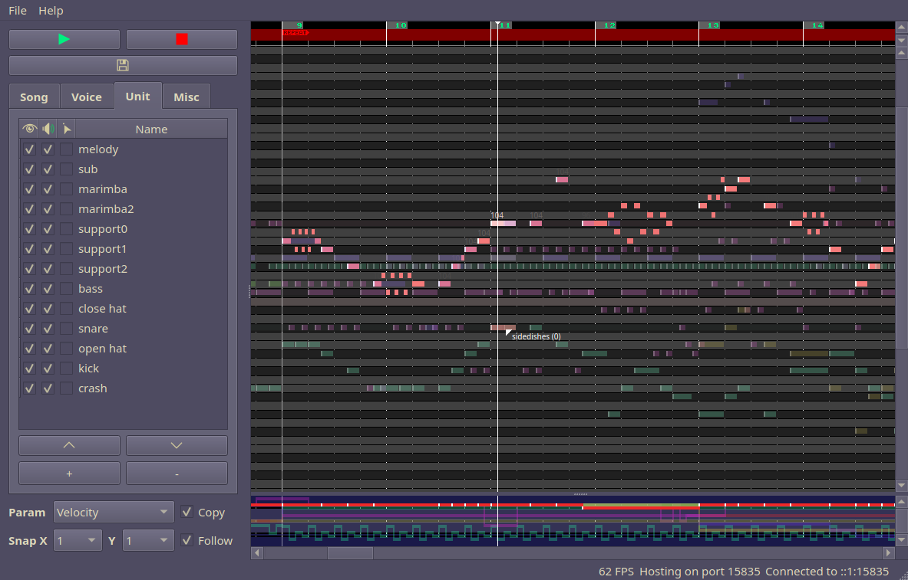

# pxtone collab

  

pxtone collab is a music editor where you can collaborate with friends!

## Features
pxtone collab is based off pxtone collage, a music editor developed by Pixel, the creator of Cave Story and Kero Blaster. As such some features will be familiar:
 * Simple note and parameter input (pan, volume, portamento, fine-tuning, effects)
 * Hassle-free import of samples (ogg, wav) and custom instruments (ogg, wav, ptvoice, ptnoise)
 * Song parameter settings (tempo, time signature)
 
In addition, ptcollab supports:
 * Collaborative editing: host a server and have others connect and work with you!
 * Session recording: save a frame-by-frame recording of a session and play it back later!
 * MIDI input: Record notes either live while the song is playing, or using keyboard controls to step through time.

## Information
Check out the <a href="https://yuxshao.github.io/ptcollab/">landing page</a>
for more info about pxtone collab, including downloads, guides, further
links, and thank yous.

## Installation
The <a href="https://github.com/yuxshao/ptcollab/releases">releases page</a>
has executables you can download and just run!

If you're building from source, it should work with a Qt5.15 install, but does
require ogg/vorbis, rtmidi, and C++17.

On Mac, you may need to install a later version of clang (e.g., through `brew
install llvm`).

If you have these dependencies , running `qmake` and then `make` should build
an executable for you.
